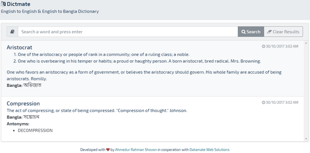
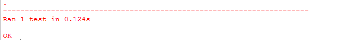

Dictmate
========

|Build Status| |Size| |Codecov|

An English to English and English to Bangla dictionary. See live [https://dictmate.herokuapp.com/](https://dictmate.herokuapp.com/)

## Software Requirements

The following environment is used to develop the application:

- **OS** : Windows 8.1 (64 bit)
- **IDE** : PyCharm Professional (Version: 2017.2.3)
- **Python** : 3.6.2 (64 bit)

### Necessary Package Installation

- Install virtual environment

		$ python -m virtualenv venv

- Activate virtual environment (Change it based on your OS)

		$ venv\Scripts\activate.bat

- Install necessary packages included in `requirements.txt`

		$ pip install -r requirements.txt
		
		
### To Run the Application

- Activate virtual environment (if not activated)

		$ venv\Scripts\activate.bat

- Run the `application.py`

		$ python app.py

		
### Unit testing

- Activate virtual environment (if not activated)

		$ venv\Scripts\activate.bat

- Run the `tests.py`

		$ python tests.py

		
		
### What is this repository for?

- Quick summary
- Version Controlling
- Screenshot enlisting of each phase (See attached Screenshot folder)
- [Issue Tracking](https://bitbucket.org/arsho/dictmate/issues)

## Acknowledgments

- English to English JSON file provided by [Webster's Unabridged English Dictionary](https://github.com/matthewreagan/WebstersEnglishDictionary)
- SQLite database for English to Bangla dictionary provided by [bendict](https://github.com/nitish94/bendict). The SQLite database is converted to JSON file in our project.

.. |Build Status| image:: https://travis-ci.org/arsho/dictmate.svg?branch=master
   :target: https://travis-ci.org/arsho/dictmate
      
.. |Size| image:: https://img.shields.io/github/size/arsho/dictmate/app.py.svg?
   :target: https://github.com/arsho/dictmate/   
   
.. |Codecov| image:: https://codecov.io/github/arsho/dictmate/coverage.svg?branch=master
   :target: https://codecov.io/github/arsho/dictmate